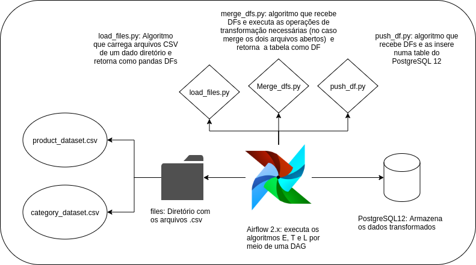

# Desafio Técnico
## Estágio Eng. Dados - Dataholds
 
### Objetivo
Criar uma DAG no Airflow que extraia todos os registros de produtos, enriqueça com o nome da categoria e insira em uma tabela postgresSQL chamada dimensao_produto.

### Fonte de dados
category_dataset: category_dataset.csv
product_dataset: product_dataset.csv

### Entrega:
Código fonte python e scripts de banco de dados necessários.

### Requisitos
Airflow 2.0
PostgresSQL 12
Python 3.8

### Forma de avaliação 
vamos replicar a solução criada em nosso ambiente de desenvolvimento Dataholds. 

# Solução proposta

